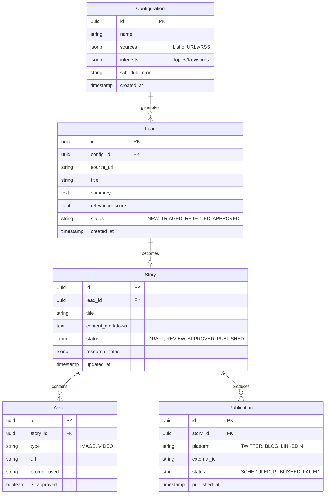

# Data Model Specification

## Overview
This document defines the database schema for lo6. We use a relational model (PostgreSQL) to ensure data integrity.

## Entity Relationship Diagram (Mermaid)

## Table Definitions

### 1. Configuration
Stores user settings for the "Configuration Agent".
- **sources**: JSON array of source objects `{ type: 'rss' | 'twitter' | 'crawler' | 'network_signal', url: string }`.
- **interests**: JSON array of strings.

### 2. Lead
Represents a raw item found by the "Source Finding Agent".
- **status**: State machine tracking (New -> Triaged -> Approved).

### 3. Story
The core content entity managed by "Editorial" and "Journalist" agents.
- **content_markdown**: The actual article text.
- **research_notes**: Structured output from the Research Agent.

### 4. Asset
Media files associated with a story.
- **prompt_used**: Stored for reproducibility/debugging of Image Gen Agent.
